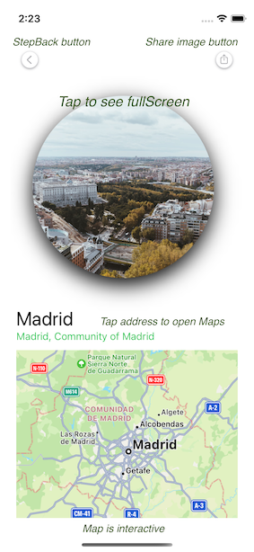

# PassporterApp

## Description

## Run Requirements

* Xcode 13
* iOS15

## Build and run the application

When we run the application, we can see a tableView with server results. We can filter the results by name or address using the searchBar above.

If we tap a cell we can see a Detail Screen with different elements: 

- Image: tap to see full screen
- BackButton: tap to step back
- ShareButton: tap to share image
- City name
- City Address: tap to open Maps and see the location with a red Pin
- Map: with interaction enabled

In this screen we can tap on User Tab and we will see a UserScreen.

- if we don't fill both fields, the alert won't show on screen, otherwise if we add some username and password, we will see an alert that confirms user is already logged (Persistence is not included in the project, so when we close the alert, the app will do nothing) 

